# Fable Foundry : Online Bookstore
A modern online bookstore where readers can browse, wishlist, and purchase their favorite books , powered by a fullstack **Java Spring + React platform**.

## Project Overview:
Fable Foundry is a fully responsive online bookstore built with a scalable architecture and clean UI/UX.
Users can easily explore books, manage carts, purchase titles, track orders, and get support using an integrated **AI-powered chat assistant**.
An Admin Dashboard provides full control over books, users, analytics, and logs.

## Features:
  ### User Features
  + Login & secure authentication
  + Browse books by categories & filters
  + Add to wishlist
  + Add to cart & purchase books
  + Track order status:  Order Placed → Processing → Shipped → Out for Delivery → Delivered
  + Manage user profile
  + View complete order history (with timestamps)
  + AI-powered chatbot assistant to help users explore books

  ### Admin Features
  + Manage books (add, update, delete)
  + Manage users
  + Sales analytics & reports
  + View system logs

## Tech Stack:
  ### Frontend
  + React.js
  + CSS - MUI
  + Axios
    
  ### Backend
  + Java Spring Boot
  + Spring Security
  + MySQL
  
  ### Tools
  + VSCode for the frontend
  + Spring Tool Suite for the backend
  + MySQL Workbench for database

## Getting Started (Local Setup): 
1. Clone the repository.
2. Run the backend using Spring Tool Suite or *mvn spring-boot:run*
3. Run the frontend using *npm start*

## Visual Preview:
| Section         | Image                                               |
| --------------- | --------------------------------------------------- |
| Landing Page    | 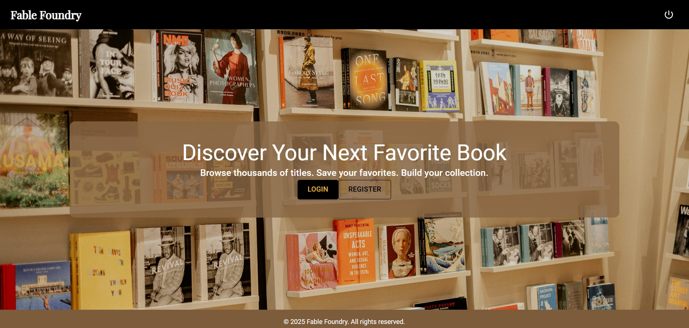        |
| User Dashboard  |  |
| Book Detail     | 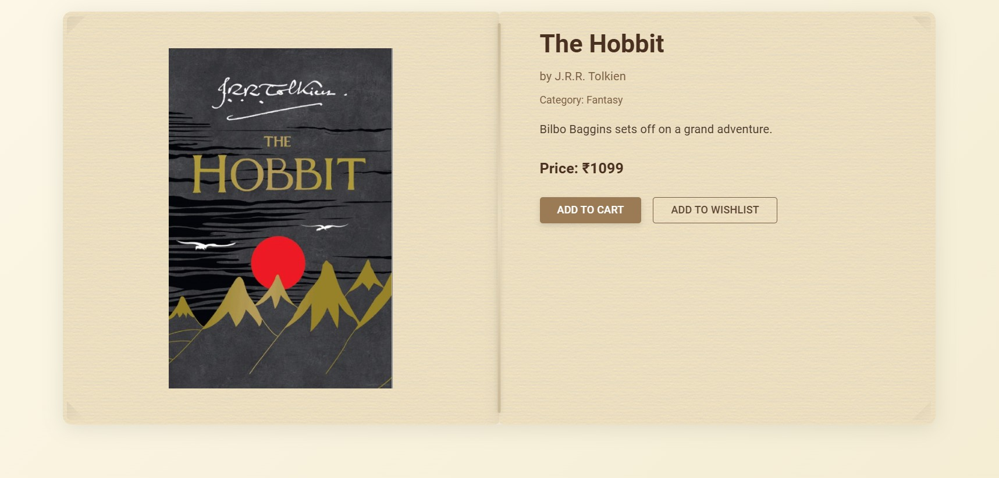        |
| About           | 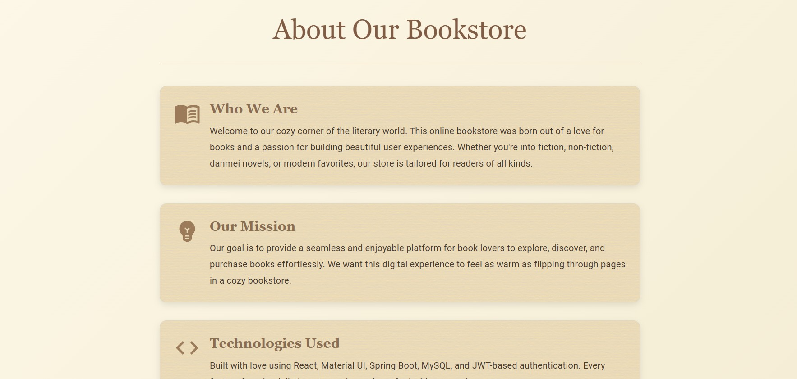                   |
| Wishlist        | 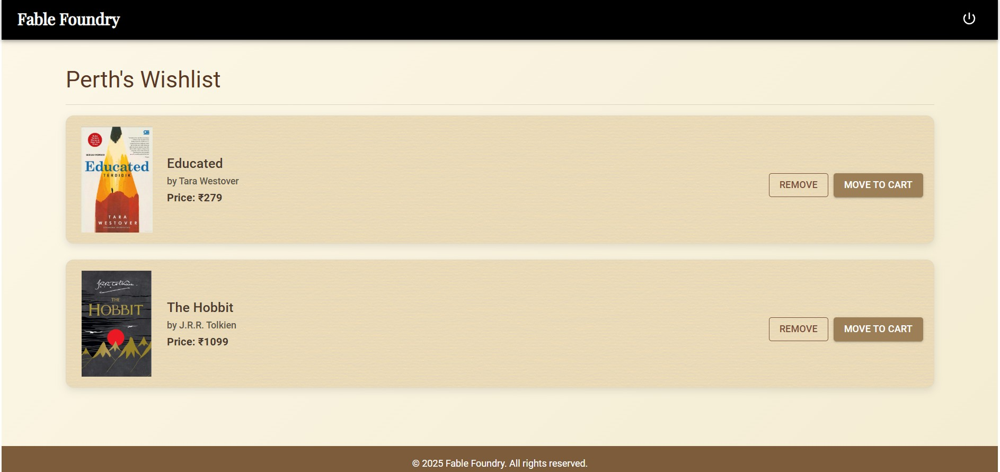             |
| Cart            | 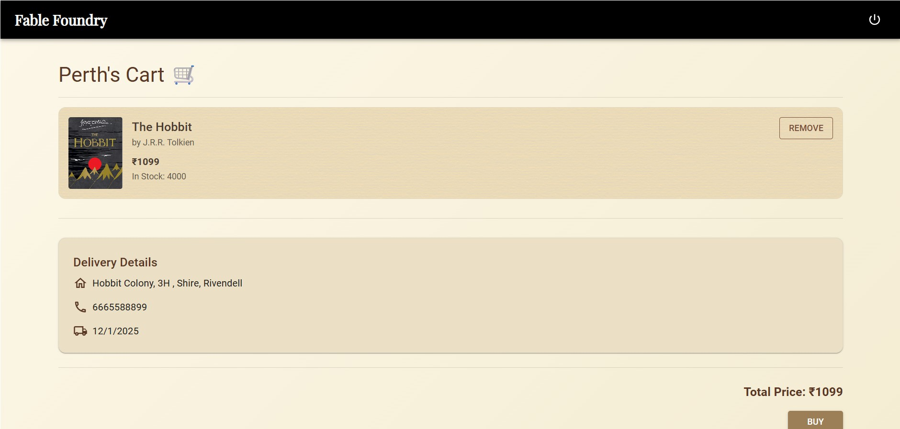                     |
| Profile         | 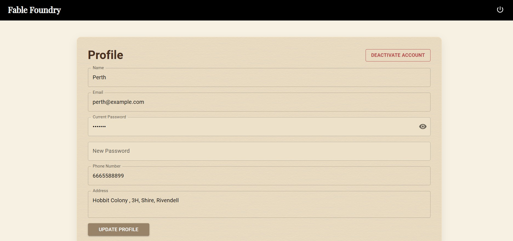               |
| Admin Dashboard | 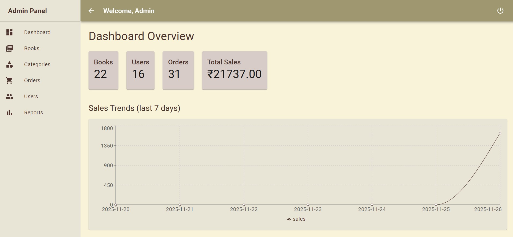  |
| Books           | 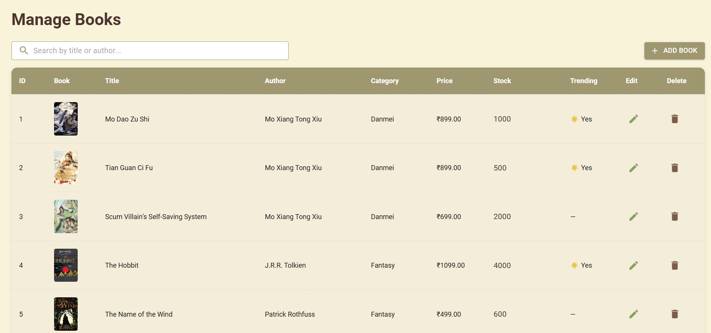                |
| Orders          | 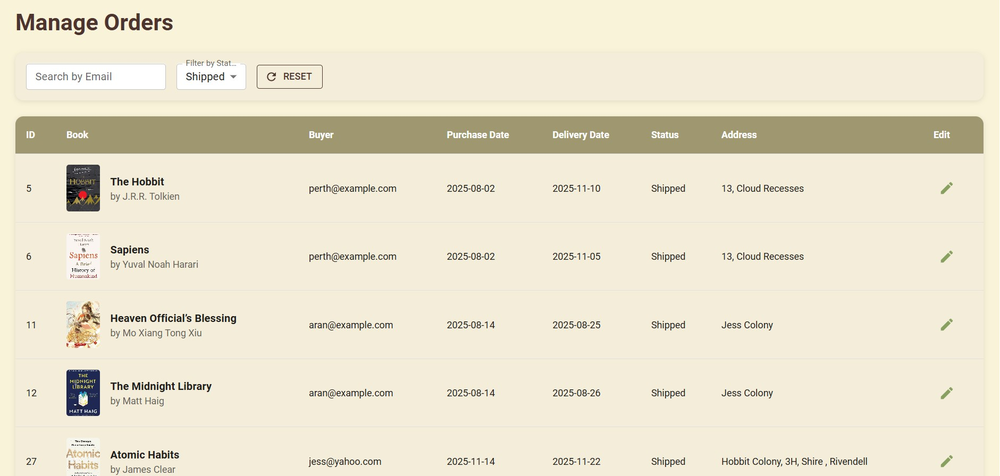              |
| Users           | 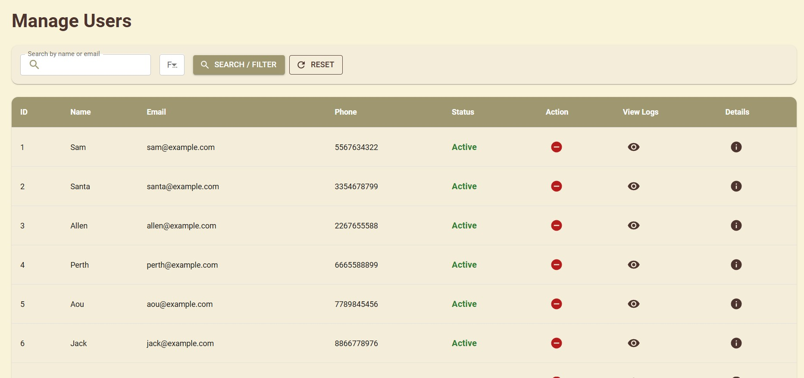                |
| Report          | 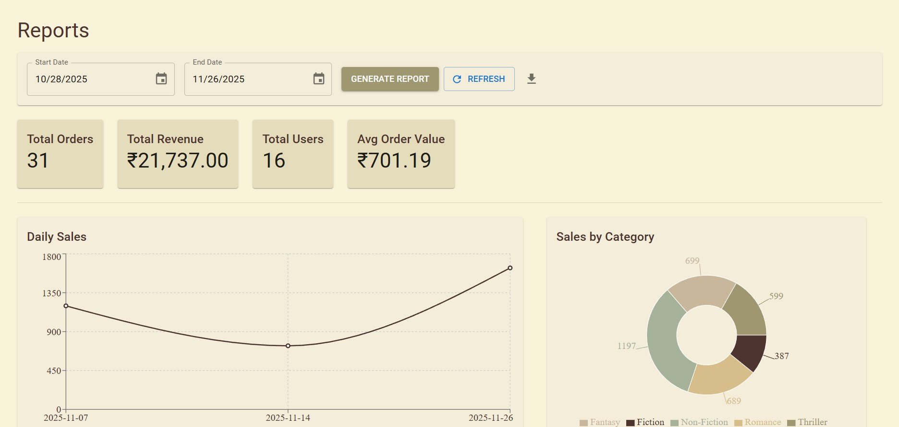              |

## License: 
The project is licensed under **MIT license** .

## Developer:
Email : **snehahyn@gmail.com**
Github: **https://github.com/code4min**

  

  

